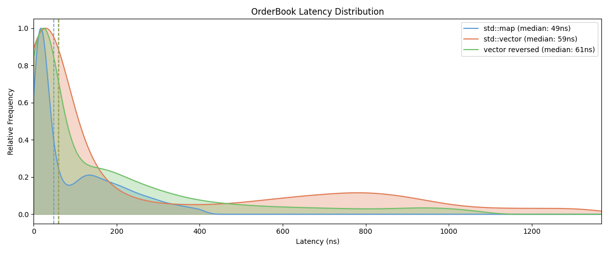

# Order Book Engine

High-performance C++20 limit order book designed for ultra-low latency trading systems.

- Sub-100ns order processing (p50)
- O(1) order cancellation via direct pointer indexing
- MBO (Market-by-Order) matching engine with FIFO execution
- Custom rdtsc-based benchmarking harness replayed against 12M+ real BTC L2 events

---

## Performance (Linux Native / Ubuntu, GCC Release)

| Operation | p50 | p99 | p99.9 |
|----------|-----|-----|-------|
| addOrder (no match) | 50.1 ns | 1.4 µs | 4.0 µs |
| addOrder (full match) | 40.1 ns | 120.2 ns | 320.6 ns |
| cancelOrder | 60.1 ns | 410.8 ns | 871.7 ns |
| sweep (8 levels) | 250.5 ns | 450.9 ns | 691.3 ns |
| sweep (64 levels) | 2.0 µs | 2.1 µs | 5.4 µs |
| sweep (256 levels) | 8.7 µs | 12.2 µs | 14.9 µs |
| sweep (1024 levels) | 32.3 µs | 36.6 µs | 50.1 µs |

KDE latency distribution across three implementations replayed against the same 12M+ BTC L2 event stream: `std::map`, `std::vector` (ascending price levels), and `std::vector` with bids/asks reversed (best price at back). All distributions clipped at p95.

---

## Core Design

### Matching Engine (MBP + FIFO)
- Orders matched across all price levels (not just top-of-book)
- FIFO queue per price level ensures fair execution ordering
- Partial fills supported with remainder resting in-book

---

### Price Levels
- Intrusive doubly-linked list stored directly in `Order`
- Eliminates STL node allocation overhead
- O(1) insertion/removal within a price level

---

### Order Lookup (O(1) cancel)
- `unordered_map<OrderId, Order*>` → direct pointer access
- No traversal required for cancellation or modification
- Enables deterministic cancellation latency

---

### Modify / Cancel Semantics
- **Cancel:** O(1) removal via hash lookup + pointer unlink
- **Modify:** updates order quantity in-place while preserving:
  - original FIFO position
  - original price-time priority ordering
- No reinsertion required for size changes (avoids queue reshuffle)

---

### Memory Management
- Custom `OrderPool` and `PriceLevelPool` using free-list recycling
- Recycled slots reused via in-place assignment — no heap allocation on the hot path
- Designed for steady-state zero-allocation behavior

---

### Design Tradeoff: `std::map` vs `std::vector`

Both `std::map` and `std::vector`-based price ladders were benchmarked against the same 12M+ real BTC L2 event stream.

`std::vector` was evaluated in two configurations: sorted ascending (best price at back) and sorted descending (best price at front). Both vector variants showed comparable or worse p50 latency than `std::map` in practice, driven by the O(n) insert/erase cost on level creation and deletion during sweeps.

`std::map` was retained as the production implementation because it provides:
- O(log n) insert/erase with no shifting cost
- full price-range flexibility (any instrument, any tick size)
- memory proportional to active price levels (sparse efficiency)
- consistent latency without pathological cases on sweep-heavy workloads

---

## Order Types

| Type | Behaviour |
|------|-----------|
| `GOOD_TILL_CANCEL` | Rests in book until explicitly cancelled or fully filled |
| `FILL_AND_KILL` | Fills what it can immediately, remainder discarded |
| `MARKET_ORDER` | No price specified — fills at best available price, remainder discarded |

---

## Matching Logic

- Buy orders walk asks upward while price condition holds
- Sell orders walk bids downward
- Fully consumed levels are erased from active book
- Self-trade prevention cancels internal matches at source
- `bestBid_` / `bestAsk_` maintained as O(1) cached pointers to top-of-book price levels

---

## Benchmarking

- Custom `rdtsc` cycle-accurate harness
- 100,000 iterations per measurement
- Warm vs cold cache isolation
- 100ms calibration window for cycle → ns conversion

---

## Key Engineering Focus

- Cache efficiency over algorithmic complexity
- Pointer-based data structures over STL abstractions
- Allocation elimination via pooling
- Deterministic latency measurement