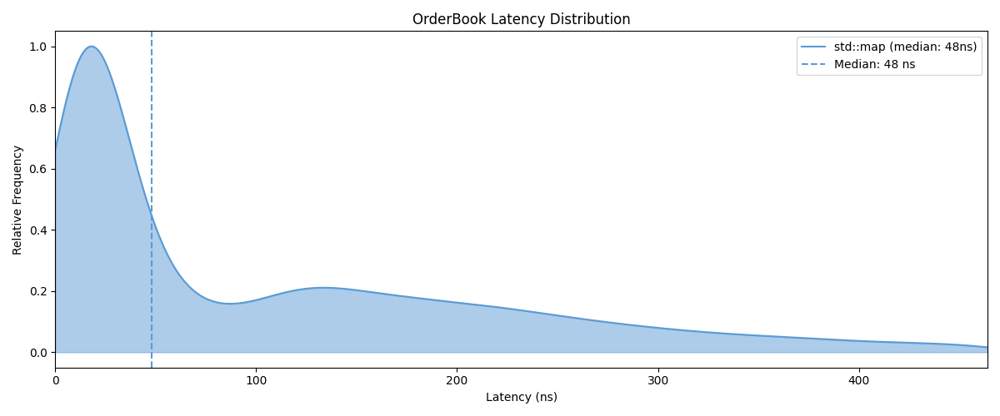

# Order Book Engine

High-performance C++20 limit order book designed for ultra-low latency trading systems.

- Sub-100ns order processing (p50)
- O(1) order cancellation via direct pointer indexing
- MBO (Market-by-Order) matching engine with FIFO execution
- Custom rdtsc-based benchmarking harness replayed against 12M+ real BTC L2 events

---

## Performance (Linux / WSL2, GCC Release)

| Operation | p50 | p99 | p99.9 |
|----------|-----|-----|-------|
| addOrder (no match) | 58.7 ns | 2.5 µs | 19.3 µs |
| addOrder (full match) | 49.2 ns | 304.9 ns | 668.9 ns |
| cancelOrder | 118.0 ns | 668.9 ns | 1.2 µs |
| sweep (8 levels) | 423 ns | 836.1 ns | 1.3 µs |
| sweep (64 levels) | 3.4 µs | 6.7 µs | 26.2 µs |
| sweep (256 levels) | 14.0 µs | 32.6 µs | 114.8 µs |
| sweep (1024 levels) | 55.0 µs | 125.5 µs | 256.3 µs |

---

## Core Design

### Matching Engine (MBP + FIFO)
- Orders matched across all price levels (not just top-of-book)
- FIFO queue per price level ensures fair execution ordering
- Partial fills supported with remainder resting in-book

---

### Price Levels
- Intrusive doubly-linked list stored directly in `Order`
- Eliminates STL node allocation overhead
- O(1) insertion/removal within a price level

---

### Order Lookup (O(1) cancel)
- `unordered_map<OrderId, Order*>` → direct pointer access
- No traversal required for cancellation or modification
- Enables deterministic cancellation latency

---

### Modify / Cancel Semantics
- **Cancel:** O(1) removal via hash lookup + pointer unlink
- **Modify:** updates order quantity in-place while preserving:
  - original FIFO position
  - original price-time priority ordering
- No reinsertion required for size changes (avoids queue reshuffle)

---

### Memory Management
- Custom `OrderPool` using free-list recycling
- Recycled slots reused via in-place assignment — no heap allocation on the hot path
- Designed for steady-state zero-allocation behavior

---

### Design Tradeoff: `std::map` vs `std::array`

A `std::array`-based price ladder was evaluated as an alternative to `std::map` for O(1) indexed price access. While arrays provide constant-time lookup, they require a fixed price range and tick size, tightly coupling the engine to a specific instrument.

In contrast, `std::map` provides:
- full price-range flexibility (any instrument, any tick size)
- memory proportional to active price levels (sparse efficiency)
- acceptable log(n) overhead relative to matching and traversal cost

Given that real-world books are sparse across large price spaces, the map-based design avoids significant memory waste and maintains flexibility without measurable latency degradation in observed benchmarks.

---

## Matching Logic

- Buy orders walk asks upward while price condition holds
- Sell orders walk bids downward
- Fully consumed levels are erased from active book
- Self-trade prevention cancels internal matches at source

---

## Benchmarking

- Custom `rdtsc` cycle-accurate harness
- 100,000 iterations per measurement
- Warm vs cold cache isolation
- 100ms calibration window for cycle → ns conversion

---

## Key Engineering Focus

- Cache efficiency over algorithmic complexity
- Pointer-based data structures over STL abstractions
- Allocation elimination via pooling
- Deterministic latency measurement