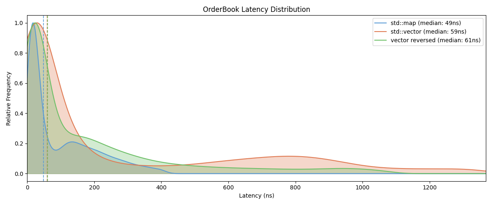

# Order Book Engine

High-performance C++20 limit order book designed for ultra-low latency trading systems.

- Sub-100ns adds and cancels at steady state (40ns / 30ns p50)
- O(1) order cancellation via direct pointer indexing
- MBO (Market-by-Order) matching engine with FIFO execution
- Custom rdtsc-based benchmarking harness replayed against 12M+ real BTCUSDT L2 events from the [Bybit public order book archive](https://public.bybit.com/orderbook/), dated April 22, 2026 (CSV replay)

---

## Performance (Linux Native / Ubuntu, GCC Release)

<!-- TODO: add hardware line when at machine, e.g.:
Benchmarked on [CPU model] @ [X.X GHz], GCC [version], -O3 [-march=native], performance governor.
-->

| Operation | p50 | p99 | p99.9 |
|----------|-----|-----|-------|
| addOrder (no match, steady state) | 40.1 ns | 70.1 ns | 1.7 µs |
| addOrder (no match, new level) | 110.2 ns | 1.6 µs | 3.1 µs |
| addOrder (full match) | 40.1 ns | 170.3 ns | 310.6 ns |
| cancelOrder | 30.1 ns | 270.5 ns | 350.7 ns |
| sweep (8 levels) | 380.7 ns | 1.1 µs | 1.7 µs |
| sweep (64 levels) | 3.8 µs | 6.1 µs | 10.4 µs |
| sweep (256 levels) | 12.8 µs | 20.3 µs | 25.5 µs |
| sweep (1024 levels) | 46.3 µs | 59.8 µs | 68.5 µs |

KDE latency distribution across three implementations replayed against the same 12M+ BTC L2 event stream: `std::map`, `std::vector` (ascending price levels), and `std::vector` with bids/asks reversed (best price at back). All distributions clipped at p95.

---

## Core Design

### Matching Engine (MBO)

- Orders matched across all price levels (not just top-of-book)
- FIFO queue per price level ensures fair execution ordering
- Partial fills supported with remainder resting in-book

---

### Price Levels

- Intrusive doubly-linked list stored directly in `Order`
- Eliminates STL node allocation overhead
- O(1) insertion/removal within a price level

---

### Order Lookup (O(1) cancel)

- `unordered_map<OrderId, Order*>` → direct pointer access
- No traversal required for cancellation or modification
- Enables deterministic cancellation latency

---

### Modify / Cancel Semantics

- **Cancel:** O(1) removal via hash lookup + pointer unlink
- **Modify:** updates order quantity in-place while preserving:
  - original FIFO position
  - original price-time priority ordering
- No reinsertion required for size changes (avoids queue reshuffle)

---

### Memory Management

- Custom `OrderPool` and `PriceLevelPool` using free-list recycling
- Recycled slots reused via in-place assignment, with no heap allocation on the hot path
- Both pools expose a capacity constructor that pre-allocates all slots upfront, eliminating `new` entirely from the measured path
- `OrderBook` accepts separate `order_capacity` and `level_capacity` parameters because orders and price levels are different scales (a book with 10k live orders may have only ~500 active levels), so over-allocating a single shared pool would waste memory
- Designed for steady-state zero-allocation behavior

---

### Design Tradeoff: `std::map` vs `std::vector`

Both `std::map` and `std::vector`-based price ladders were benchmarked against
the same 12M+ real BTC L2 event stream. Reconstructing the observed depth-200
book produced the following event distribution:

| Event type | Count | Share |
| --- | ---: | ---: |
| Add | 5,024,749 | 39.5% |
| Update | 2,681,024 | 21.1% |
| Delete | 5,024,349 | 39.5% |
| **Total** | **12,730,122** | **100%** |

Classification follows
[Bybit's L2 price-level semantics](https://bybit-exchange.github.io/docs/v5/websocket/public/orderbook):
a positive size at a new price is an add, a positive size at an active price
is an update, and a zero size deletes the price level. The feed aggregates all
orders at each price, so zero means all quantity at that level was filled or
cancelled. A partial reduction is sent as a positive replacement size and
remains an update.

Adds and deletes account for 78.9% of events, meaning most events changed the
set of active price levels.

This high level churn favors `std::map`: a sorted `std::vector` must shift
elements on level insertion and removal (O(n)), while `std::map` performs those
operations in O(log n) without shifting the price ladder. Both ascending and
descending vector configurations showed comparable or worse p50 latency in the
benchmark.

`std::map` was retained as the production implementation because it provides:

- O(log n) insert/erase with no shifting cost
- full price-range flexibility (any instrument, any tick size)
- memory proportional to active price levels (sparse efficiency)
- consistent latency without pathological cases on sweep-heavy workloads

---

## Order Types

| Type | Behaviour |
|------|-----------|
| `GOOD_TILL_CANCEL` | Rests in book until explicitly cancelled or fully filled |
| `FILL_AND_KILL` | Fills what it can immediately, remainder discarded |
| `MARKET_ORDER` | No price specified; fills at best available price, remainder discarded |
| `FILL_OR_KILL` | Must be filled entirely and immediately, otherwise the whole order is cancelled |
| `POST_ONLY` | Only accepted if it adds liquidity; if it would cross the spread and fill, it is rejected |

---

## Matching Logic

- Buy orders walk asks upward while price condition holds
- Sell orders walk bids downward
- Fully consumed levels are erased from active book
- Self-trade prevention cancels internal matches at source
- `bestBid_` / `bestAsk_` maintained as O(1) cached pointers to top-of-book price levels

---

## Benchmarking

- Custom `rdtsc`/`rdtscp` + `lfence` cycle-accurate harness: `lfence` before `rdtsc` serializes prior instructions, while `rdtscp` + `lfence` after prevents the CPU from reordering the timestamp read before the measured work completes
- 100,000 iterations per measurement, 100ms calibration window for cycle → ns conversion
- Pools and `orderMap_` pre-allocated to capacity before measurement, eliminating `new` and `unordered_map` rehash from the hot path
- Steady-state depth: cancelOrder and addOrder (no match) cycle through a fixed price range so book depth stays constant across all samples
- Sweep books pre-built outside the measurement loop to isolate matching cost from pool construction and order insertion
